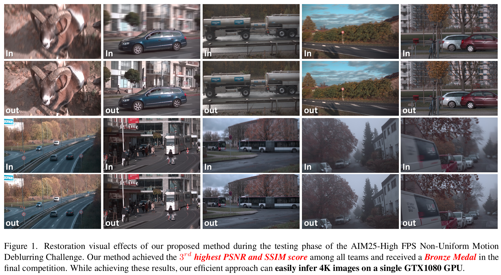

# Efficient High FPS Non-Uniform Motion Deblurring via Progressive Learning

<a href='https://openaccess.thecvf.com/content/ICCV2025W/AIM/papers/Lu_Efficient_High_FPS_Non-Uniform_Motion_Deblurring_via_Progressive_Learning_ICCVW_2025_paper.pdf'></a> &nbsp;&nbsp;

<a href='https://github.com/xin1u/EMD'></a> &nbsp;&nbsp;

## :trophy: Bronze Medal of the ICCV 2025 High FPS Non-Uniform Motion Deblurring Challenge

Our team **BlurKing** achieved the **3rd highest PSNR** and **3rd highest SSIM** score and received a **Bronze Medal** in the [ICCV 2025 High FPS Non-Uniform Motion Deblurring Challenge](https://codalab.lisn.upsaclay.fr/).

This is the official PyTorch implementation of the paper:

>**Efficient High FPS Non-Uniform Motion Deblurring via Progressive Learning**<br>
>Xin Lu, Zhijing Sun, Chengjie Ge, Yufeng Peng, Ziang Zhou, Zihao Li, Zishun Liao, Dong Li, Qiyu Kang, Xueyang Fu<sup>&dagger;</sup>, Zheng-Jun Zha<br>
>University of Science and Technology of China (USTC)<br>
>ICCV Workshop 2025




## :wrench: Dependencies and Installation

```bash
git clone https://github.com/xin1u/EMD.git
cd EMD
pip install -r requirements.txt
```

**Main dependencies:** PyTorch >= 1.10, torchvision, numpy, Pillow, timm, tensorboard, lpips


## :file_folder: Project Structure

```
EMD/
    ├── ckpt/                         # Pre-trained checkpoints
    │   └── best_model.pth            # Best model weights
    ├── datasets/                     # Dataset loading
    │   └── datasets_pairs.py
    ├── loss/                         # Loss functions
    │   ├── losses.py                 # Charbonnier, FFT, SSIM, LPIPS losses
    │   └── contrastive_loss.py       # Contrast regularization loss (VGG-19)
    ├── networks/                     # Model architectures
    │   ├── emd_arch.py               # Efficient Deblurring U-Net (SGM + SCA + MFFM)
    │   ├── image_utils.py            # Image splitting & merging
    │   └── ...
    ├── utils/
    │   └── UTILS.py                  # Metrics & utilities
    ├── TEST.py                       # Inference script (with input ensemble)
    └── train_emd.py                  # Training script (three-stage progressive)
```


## :surfer: Quick Start

**Step 1: Download Checkpoints**

Download the pre-trained checkpoint and place it in the `ckpt/` directory:
- `best_model.pth` — Efficient Deblurring U-Net

**Step 2: Run Testing**

```bash
python TEST.py \
    --eval_in_path ./test_images/ \
    --result_path ./results/ \
    --inputs_ensemble True
```

The restored results will be saved in `./results/`. A log file at `./results/log_file/test.txt` records per-image PSNR/SSIM metrics.


## :muscle: Train

**Step 1: Prepare Data**

Prepare training pairs (blurry / sharp images). We use the AIM 2025 High FPS Non-Uniform Motion Deblurring dataset.

**Step 2: Three-stage Progressive Training**

Our training follows a multi-scale progressive learning strategy:

1. **Stage 1** — Train with Charbonnier + FFT + Contrast loss (Adam, lr=4e-4, batch=22, patch=256, 1000 epochs):
```bash
python train_emd.py \
    --experiment_name stage1 \
    --unified_path ./experiments/ \
    --training_path_txt data/train_list.txt \
    --eval_in_path /PATH/val_input/ \
    --eval_gt_path /PATH/val_gt/ \
    --training_stage 1 \
    --BATCH_SIZE 22 \
    --Crop_patches 256 \
    --learning_rate 0.0004 \
    --EPOCH 1000 \
    --base_loss char \
    --addition_loss fft \
    --addition_loss_coff 0.02 \
    --use_contrast True \
    --contrast_coff 0.1
```

2. **Stage 2** — Resume from Stage 1, train with Charbonnier + SSIM + Contrast loss (Adam, lr=4e-5, batch=3, patch=640, 300 epochs):
```bash
python train_emd.py \
    --experiment_name stage2 \
    --unified_path ./experiments/ \
    --training_stage 2 \
    --load_pre_model True \
    --pre_model ./experiments/stage1/best_model.pth \
    --BATCH_SIZE 3 \
    --Crop_patches 640 \
    --learning_rate 0.00004 \
    --EPOCH 300 \
    --base_loss char \
    --addition_loss ssim \
    --addition_loss_coff 0.2 \
    --use_contrast True \
    --contrast_coff 0.1 \
    --grad_accum_steps 4
```

3. **Stage 3** — Fine-tune with Charbonnier + LPIPS + Contrast loss (SGD, lr=2e-5, batch=1, patch=1080x640, 200 epochs):
```bash
python train_emd.py \
    --experiment_name stage3 \
    --unified_path ./experiments/ \
    --training_stage 3 \
    --load_pre_model True \
    --pre_model ./experiments/stage2/best_model.pth \
    --BATCH_SIZE 1 \
    --Crop_patches 1080 \
    --learning_rate 0.00002 \
    --EPOCH 200 \
    --optim sgd \
    --base_loss char \
    --addition_loss lpips \
    --addition_loss_coff 0.6 \
    --use_contrast True \
    --contrast_coff 0.1 \
    --grad_accum_steps 4
```


## :book: Citation

If you find our repo useful for your research, please consider citing our paper:

```bibtex
@InProceedings{Lu_2025_ICCV_EMD,
    author    = {Lu, Xin and Sun, Zhijing and Ge, Chengjie and Peng, Yufeng and Zhou, Ziang and Li, Zihao and Liao, Zishun and Li, Dong and Kang, Qiyu and Fu, Xueyang and Zha, Zheng-Jun},
    title     = {Efficient High FPS Non-Uniform Motion Deblurring via Progressive Learning},
    booktitle = {Proceedings of the IEEE/CVF International Conference on Computer Vision (ICCV) Workshops},
    month     = {October},
    year      = {2025}
}
```


## :postbox: Contact

Please feel free to contact us if there is any question (luxion@mail.ustc.edu.cn).
